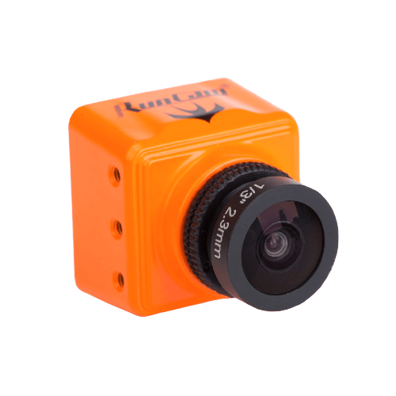
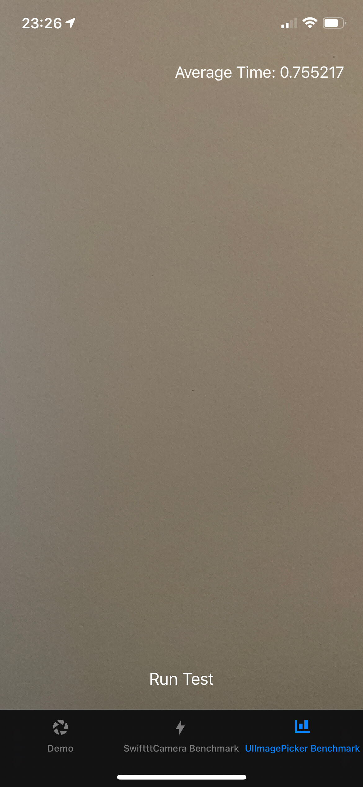

<div align="center">
  
  <h1>SwiftttCamera</h1>
  <p><strong>Swifttty and easy camera framework for iOS.</strong></p>

  <a href="https://github.com/rogerluan/SwiftttCamera/actions/workflows/run_tests.yml">
    
  </a>
  <a href="https://swift.org">
    
  </a>

  <a href="https://github.com/rogerluan/SwiftttCamera/releases/latest">
    
  </a>

  <a href="https://codeclimate.com/github/rogerluan/SwiftttCamera/maintainability"></a>

  <a href="https://github.com/rogerluan/SwiftttCamera/issues">
    
  </a>
  <a href="https://twitter.com/intent/follow?screen_name=rogerluan_">
    
  </a>

  <p align="center">
    <a href="#demo">View Demo</a>
    ·
    <a href="https://github.com/rogerluan/SwiftttCamera/issues/new/choose">Report Bug</a>
    ·
    <a href="https://github.com/rogerluan/SwiftttCamera/issues/new/choose">Request Feature</a>
  </p>
</div>

`SwiftttCamera` is a wrapper around `AVFoundation` that allows you to build your own powerful custom camera app without all the headaches of using `AVFoundation` directly. It is strongly based off of [FastttCamera](https://github.com/IFTTT/FastttCamera), but since that project hasn't been maintained since 2016, this project aims to give life back to that awesome framework, with the same perks, but using more modern APIs, and limiting supported SDKs to iOS 13+ only.

#### Major headaches that `SwiftttCamera` automatically handles for you:

##### `AVFoundation` Headaches

* Configuring and managing an `AVCaptureSession`.
* Displaying the `AVCaptureVideoPreviewLayer` in a sane way relative to your camera's view.
* Configuring the state of the `AVCaptureDevice` and safely changing its properties as needed, such as setting the flash mode and switching between the front and back cameras.
* Adjusting the camera's focus and exposure in response to tap gestures.
* Zooming the camera in response to pinch gestures.
* Capturing a full-resolution photo from the `AVCapturePhotoOutput`.

##### Device Orientation Headaches

* Changing the `AVCaptureConnection`'s orientation appropriately when the device is rotated.
* Detecting the actual orientation of the device when a photo is taken _even if orientation lock is on_ by using the accelerometer, so that landscape photos are always rotated correctly.
* _(Optional)_ Returning a preview version of the image rotated to match the orientation of what was displayed by the camera preview, even if the user has orientation lock on.
* _(Optional)_ Asynchronously returning an orientation-normalized version of the captured image rotated so that the image orientation is always `UIImage.Orientation.up`, useful for reliably displaying images correctly on web services that might not respect EXIF image orientation tags.

##### Image Processing Headaches

* _(Optional)_ Cropping the captured image to the visible bounds of your camera's view.
* _(Optional)_ Returning a scaled-down version of the captured image.
* Processing high-resolution images quickly and efficiently without overloading the device's memory or creating app-terminating memory leaks.

`SwiftttCamera` does many operations faster than `UIImagePickerController`'s camera, such as switching between the front and back camera, and provides you the captured photos in the format you need, returning a cropped full-resolution image as quickly as `UIImagePickerController` returns the raw captured image on most devices. It allows all of the flexibility of `AVFoundation` without the need to reinvent the wheel, so you can focus on making a beautiful custom UI and doing awesome things with photos.

While both `UIImagePickerController`'s camera and `AVFoundation` give you raw images that may not even be cropped the same as the live camera preview your users see, `SwiftttCamera` gives you a full-resolution image cropped to the same aspect ratio as your live preview's viewport as well as a preview image scaled to the pixel dimensions of that viewport, whether you want a square camera, a camera sized to the full screen, or something else.

`SwiftttCamera` is also smart at handling image orientation, a notoriously tricky part of images from both `AVFoundation` and `UIImagePickerController`. The orientation of the camera is magically detected correctly even if the user is taking landscape photos with orientation lock turned on, because `SwiftttCamera` checks the accelerometer to determine the real device orientation.

## Installation

`SwiftttCamera` is available through Swift Package Manager:

```
dependencies: [
    .package(name: "SwiftttCamera", url: "https://github.com/rogerluan/SwiftttCamera", .upToNextMajor(from: "1.0.0")),
]
```

## Demo

To run the demo project, clone or download the repo, and open <kbd>SwiftttCameraDemo/SwiftttCameraDemo.xcodeproj</kbd>

SwiftttCamera Benchmark|UIImagePickerController Benchmark
--|--
|

## Usage

Add an instance of `SwiftttCamera` as a child of your view controller. Adjust the size and layout of `SwiftttCamera`'s view however you'd like, and `SwiftttCamera` will automatically adjust the camera's preview window and crop captured images to match what is visible within its bounds.

```swift
import SwiftttCamera
import UIKit

class DemoViewController : UIViewController {
    private lazy var camera: SwiftttCamera = {
        let result = SwiftttCamera()
        result.delegate = self
        result.view.translatesAutoresizingMaskIntoConstraints = false
        return result
    }()

    override func viewDidLoad() {
        super.viewDidLoad()
        swiftttAddChild(camera)
        camera.view.frame = view.frame // Alternatively, you can set it up using autolayout
    }
}

extension DemoViewController : CameraDelegate {
    func cameraController(_ cameraController: CameraProtocol, didFinishCapturingImage capturedImage: CapturedImage) {
        // Handle the captured image
    }
}
```

Switch between the front and back cameras:

```swift
let newCameraDevice: CameraDevice = camera.cameraDevice.toggling()
guard SwiftttCamera.isCameraDeviceAvailable(newCameraDevice) else { return }
camera.cameraDevice = newCameraDevice
```

Set the camera's flash mode:

```swift
camera.cameraFlashMode = shouldEnable ? .on : .off
```

Set the camera's torch mode:

```swift
let shouldEnable = enabled && camera.isTorchAvailableForCurrentDevice
camera.cameraTorchMode = shouldEnable ? .on : .off
```

Take a picture:

```swift
camera.takePicture()
```

Use `SwiftttCamera`'s delegate methods to retrieve the captured image object after taking a photo:

```swift
func cameraController(_ cameraController: CameraProtocol, didFinishCapturingImage capturedImage: CapturedImage) {
    // Optional protocol function
}

func cameraController(_ cameraController: CameraProtocol, didFinishScalingCapturedImage capturedImage: CapturedImage) {
    // Optional protocol function
}

func cameraController(_ cameraController: CameraProtocol, didFinishNormalizingCapturedImage capturedImage: CapturedImage) {
    // Optional protocol function
}
```

# References

This project is strongly based off of [FastttCamera](https://github.com/IFTTT/FastttCamera). Huge thanks [Laura Skelton](https://github.com/lauraskelton), the creator of `FastttCamera` for creating such awesome project. Without her work, this project definitely wouldn't be possible. 💪

# Contributions

If you spot something wrong, missing, or if you'd like to propose improvements to this project, please open an Issue or a Pull Request with your ideas and I promise to get back to you within 24 hours! 😇

# License

This project is open source and covered by a standard 2-clause BSD license. That means you can use (publicly, commercially and privately), modify and distribute this project's content, as long as you mention *Roger Oba* as the original author of this code and reproduce the LICENSE text inside your app, repository, project or research paper.

# Contact

Twitter: [@rogerluan_](https://twitter.com/rogerluan_)
